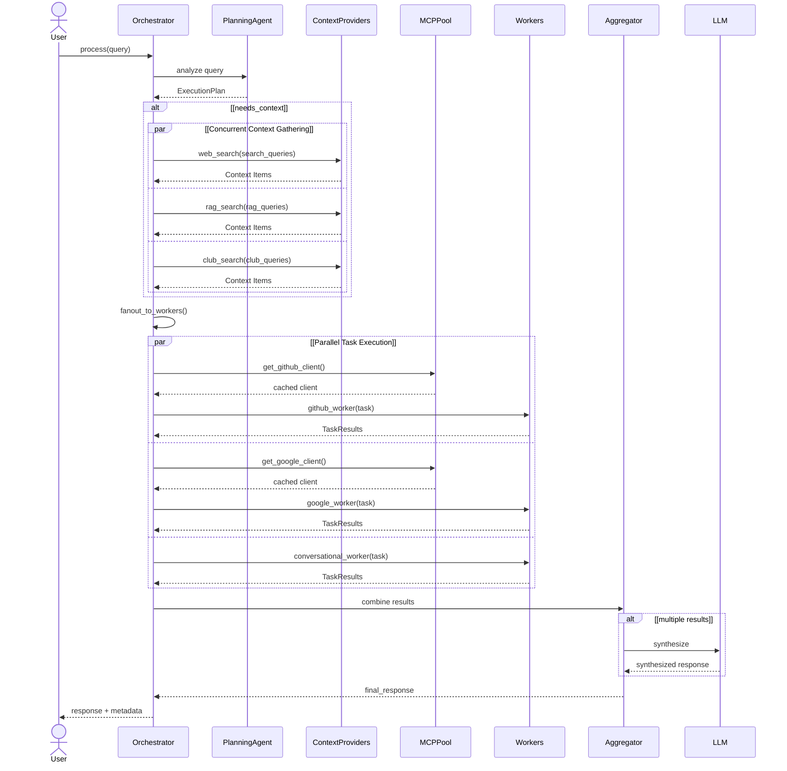

# 🤖 ClubBot — Agentic Assistant for Engineering Clubs

> One interface to manage GitHub workflows, Google Workspace, club knowledge, and the open web — built for technical clubs that move fast.

[](https://fastapi.tiangolo.com)
[](https://reactjs.org)
[](https://langchain-ai.github.io/langgraph/)
[](https://supabase.com)
[](https://modelcontextprotocol.io)

---

## 📌 What is ClubBot?

Engineering clubs drown in fragmented information — SOPs buried in personal drives, technical knowledge lost when seniors graduate, and members endlessly context-switching between GitHub, Gmail, Calendar, and documentation portals.

**ClubBot eliminates all of that.**

It is a production-grade agentic assistant that handles compound, multi-step queries across your entire club's digital footprint — in a single conversational interface.

> *"Check if there is a meeting scheduled today, find the relevant GitHub repo for that project, and summarize the last three merged PRs"* — executed autonomously, in one message.

---

## ✨ Features

| Domain | Capabilities |
|---|---|
| 🐙 **GitHub Ops** | Search repos, create/update files, manage PRs, explore codebases |
| 📧 **Gmail** | Read threads, search mail, compose and send emails |
| 📅 **Google Calendar** | Query events, create events, check availability |
| 📚 **User RAG** | Semantic search over your personally uploaded documents |
| 🏛️ **Club RAG** | Semantic search over club-wide SOPs, project write-ups, and Drive docs |
| 🌐 **Web Search** | Real-time external information via LangChain web search |

---

## 🏗️ Architecture Overview

ClubBot uses a **Planner–Executor** pattern with hierarchical task decomposition, built on LangGraph.

```
User Query
    │
    ▼
Planning Agent (70B LLM)
    │  Generates ExecutionPlan with task graph + context type
    ▼
Context Providers (parallel)
    ├── Web Search
    ├── User RAG
    └── Club RAG
    │
    ▼
Fanout to Workers (parallel)
    ├── GitHub Worker        (ReAct agent, GitHub MCP)
    ├── Google Workspace     (ReAct agent, Google MCP)
    └── Conversational       (direct LLM)
    │
    ▼
Aggregator → Final Response + Metadata
```

**Key design decisions:**
- **Per-server ReAct agents** — each worker scoped to one MCP server, eliminating context explosion
- **Tool filtering** — only relevant tools loaded per subtask, keeping context windows minimal
- **MCP Client Pool** — clients initialized once per session and cached, eliminating reconnection overhead
- **Dependency-aware execution** — tasks with inter-dependencies resolved in topological order; independent tasks run in parallel
- **Dual-layer RAG** — User RAG (personal docs) + Club RAG (Drive-synced, shared corpus)

---

## 🚀 Quick Start

### Prerequisites

- Python 3.11+
- Node.js 18+
- [`uv`](https://github.com/astral-sh/uv) (Python package manager)
- Supabase project
- Google Cloud project (OAuth credentials)
- GitHub OAuth App

### Backend Setup

```bash
cd backend

# Create and activate virtual environment
uv venv
source venv/bin/activate       # On Windows: venv\Scripts\activate

# Install dependencies
uv pip install -r requirements.txt

# Configure environment
cp .env.example .env
# Edit .env with your API keys (see Environment Variables section below)

# Start the MCP environment injection script (separate terminal)
python -m orchestration.start_script

# Start the API server
uvicorn api.main:app --reload --host 0.0.0.0 --port 8001
```

### Frontend Setup

```bash
cd frontend

npm install
cp .env.example .env
# Edit .env with your frontend environment variables

npm run dev
```

---

## 🛠️ Tech Stack

| Layer | Technology |
|---|---|
| Backend | FastAPI (Python) |
| Frontend | React |
| Database | Supabase (PostgreSQL) |
| Orchestration | Planner–Executor + LangGraph |
| Agent Framework | LangGraph + ReAct (per MCP server) |
| Tool Protocol | Model Context Protocol (MCP) |
| External Services | GitHub MCP, Google Workspace MCP (remote) |
| RAG | Dual-layer: User RAG + Club RAG (Drive-synced) |
| Web Search | LangChain Web Search Tool |
| Auth | Google OAuth 2.0, GitHub OAuth |
| Memory | Ephemeral (per-session) + Global (cross-session) |
| Validation | Pydantic |

---

## 📐 Version History

ClubBot evolved across three major iterations:

### v1 — Baseline ReAct Agent
Single LangChain ReAct agent handling all queries. Issues: context window explosion from loading all MCP schemas simultaneously, 5–6 sequential LLM calls per query, no multi-user support.

### v2 — Routing Orchestrator
Introduced a planning agent with keyword-based routing and parallel child nodes. Issues: direct tool invocation without LLM reasoning degraded accuracy; no dependency resolution between tools.

### v2.2 — Hierarchical Multi-Agent Architecture *(current)*
Full Planner–Executor with per-server ReAct agents, MCP client pool, tool filtering, dependency-aware task graphs, and automated Google auth injection. This is the production version.

---

## 🏛️ Architecture




---

## 🗺️ Roadmap (v3)

- [ ] **Human-in-the-Loop** — approval checkpoints before high-stakes actions (send email, create PR)
- [ ] **Club Relationship Management** — track project ownership, mentorship chains, contribution history
- [ ] **Task Automation** — recurring workflows: event registration, attendance tracking, report generation
- [ ] **LLM Choice** — select from multiple LLM providers (GPT-4o, Gemini, Claude) per session
- [ ] **Tool Choice** — fine-grained control over active integrations per query
- [ ] **Multimodal Support** — image/diagram input; generate architecture diagrams and charts

